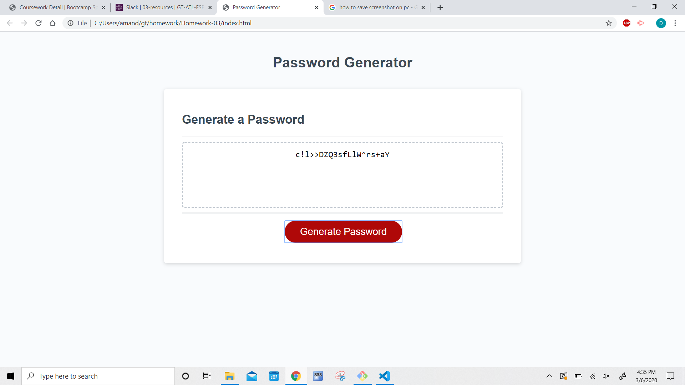

# Homework-03 Random Password Generator

## Description
Random Password Generate is a web app that can create a random password between 8 and 128 characters. It can include numbers, uppercase letters, lowercase letters, and/or special characters depending on the preference of the user. This will help in providing passwords for users that are very secure. 

## Screenshots

## Link
https://drospond.github.io/Homework-03/